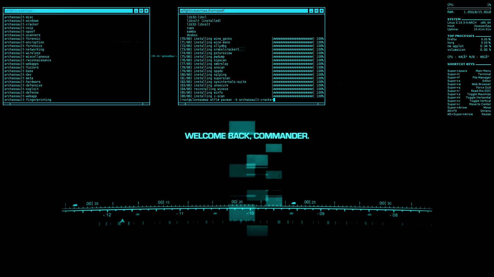

The picture above does **NOT** represent this game.

Terminal hacker game.

## Installation

If on windows, replace **srandom** with **srand**.

https://github.com/su8/hackzy/blob/a47844af728c1c6b255e38a4b112dc5b7360692c/main.cpp#L307

Tested with Visual Studio Code Editor, but you need to install MingW - https://github.com/niXman/mingw-builds-binaries/releases/download/12.2.0-rt_v10-rev0/x86_64-12.2.0-release-posix-seh-rt_v10-rev0.7z once downloaded extract it to the current folder and after that move it and rename it to **C:\MingW** then re-open Visual Studio Code Editor, you might want to install C\C++ extensions if you plan to write C\C++ code with the editor.

If on Linux or *BSD

`
make -j8 && 
sudo make install
`

---

I was inspired by https://github.com/The-Council-of-Wills/HacknetPlusPlus to create this game. I do use their **help** text.

---

The game is entirely written from my tablet with CxxDroid, only true up until to the 59th commit, afterwards the game is written from my brand new windows laptop.
