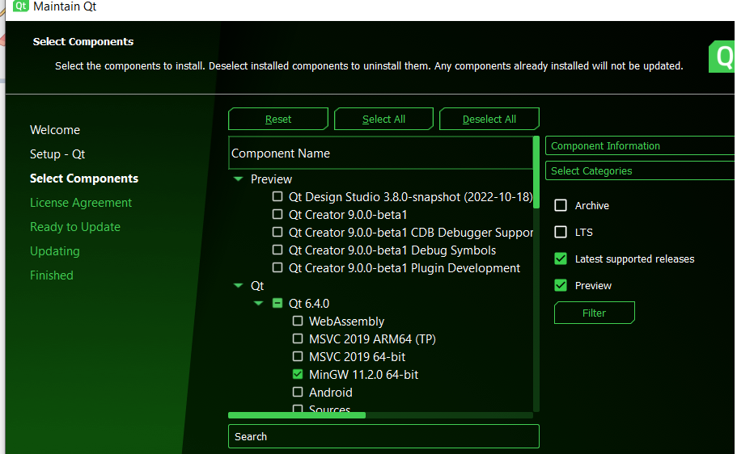
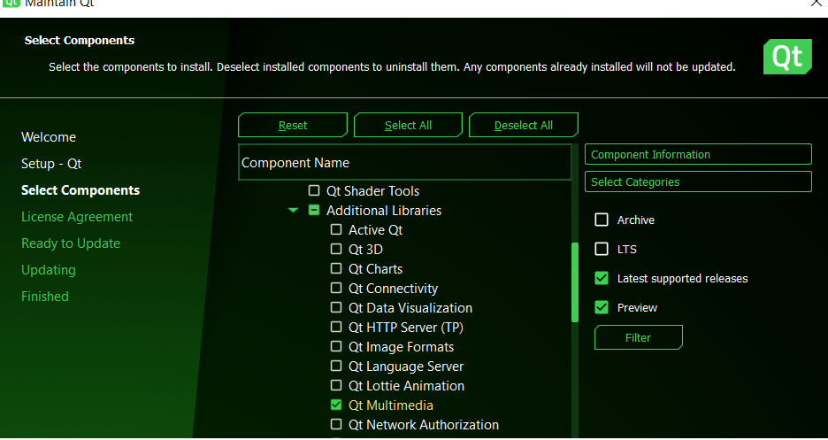

This is Qt 6 version of **hackzy**. 

---

# Compile with:

```bash
cmake --build .
make -j8 # 8 cores to use in parallel compile
sudo make install # if on linux or *BSD
```

---

# Additional codecs

You need to install the multimedia codec, so the game to play Whitesnake song. If you already installed Qt 6, go to C:\Qt and launch the **maintenace** program. Click on these options:




---

Open Qt Creator and import this project folder if you want to edit/compile **hackzy** from the Qt Creator itself. To compile and run the program from Qt Creator, press **CTRL** + **r**.

If on windows, you'll have to download the online [Qt installer](https://www.qt.io/cs/c/?cta_guid=074ddad0-fdef-4e53-8aa8-5e8a876d6ab4&signature=AAH58kEJJxpduKtfibJ40aRNSB4V5QaI1A&pageId=12602948080&placement_guid=99d9dd4f-5681-48d2-b096-470725510d34&click=559deaff-10e4-44a7-a78c-ef8b98f3c31a&hsutk=&canon=https%3A%2F%2Fwww.qt.io%2Fdownload-open-source&portal_id=149513&redirect_url=APefjpGq5H2gLEy0rkYfu04Stc7zjmm0KqS_XaAVoOUeI1pUOzGQZgD_zg87kf-KWNMA8LagnlFie8sOAzzTMW8z48C4QlIP08Ykoqpk2QaLznoki0aaOBah-YfMzg2wugOl_TcZQF2S) and install Qt 6 manually from the GUI installer.

If on windows, replace **srandom** with **srand**:

https://github.com/su8/hackzy/blob/e7f628e3902bee5b5cdea62b2697629b127e1ce5/qt6_GUI/mainwindow.cpp#L375
